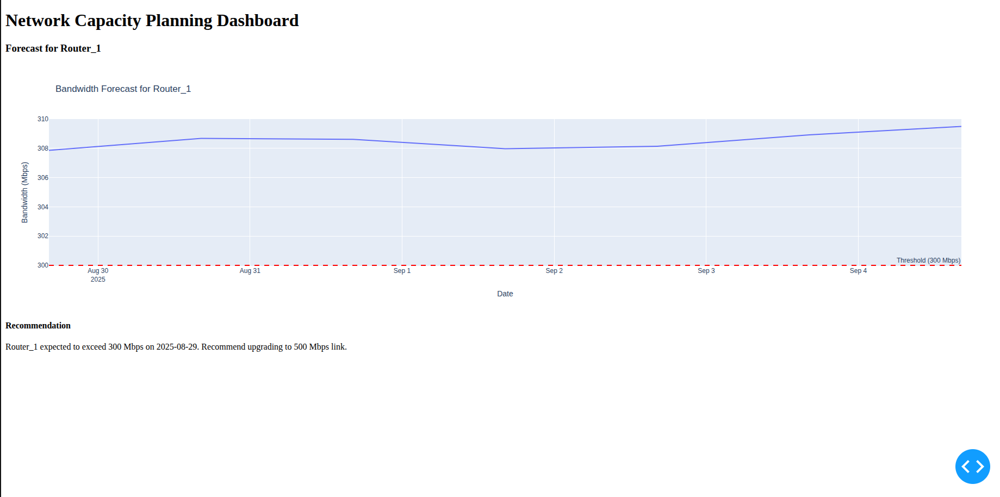
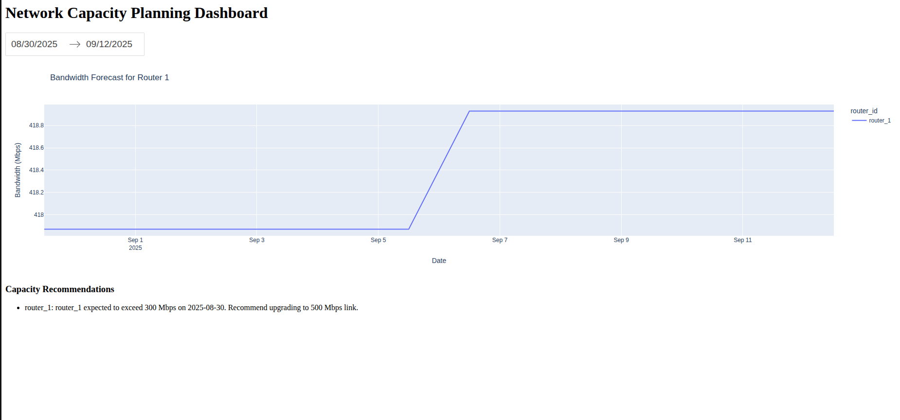

### Description:


In modern network infrastructure, managing bandwidth capacity is critical to ensure reliable performance, avoid downtime, and optimize costs. Traditional methods rely on manual monitoring and static thresholds, which are inefficient for dynamic environments like data centers or enterprise networks. The key challenges include:

- **Reactive Approach**: Networks often experience overloads before issues are detected, leading to performance degradation or outages.
- **Data Silos**: Historical network data from tools like SolarWinds is not integrated with real-time forecasting, making proactive planning difficult.
- **Scalability**: As networks grow (e.g., multiple routers, locations), manual analysis becomes unscalable, and forecasts need to handle large datasets without delays.
- **Lack of Real-Time Insights**: No continuous monitoring and forecasting, resulting in missed opportunities for timely upgrades.

This project addresses these by providing a real-time system to forecast bandwidth usage and recommend capacity upgrades for routers like router_1.


## 2. Solution Identified

The solution is an AI-powered real-time network capacity planning system using Python, Apache Kafka for streaming, TemporalFusionTransformer (TFT) for forecasting, and Dash for visualization. 
Key features:

- **Data Collection**: Simulates or fetches network data (timestamp, router_id, bandwidth_mbps, location, application_type) and publishes to Kafka for real-time processing.
- **Streaming**: Kafka handles live data ingestion, enabling continuous updates.
- **Forecasting**: TFT model predicts bandwidth usage for 14 days, detecting breaches of thresholds (e.g., 300 Mbps for router_1).
- **Dashboard**: Interactive Dash app shows forecasts, recommendations (e.g., "router_1 expected to exceed 300 Mbps on 2025-08-29. Recommend upgrading to 500 Mbps link."), with filters for dates.
- **Fallback**: Saves data to CSV for batch processing if Kafka fails.
- **Simplicity**: Tailored for one router (router_1) with 1,000 rows, but scalable.

This solution enables proactive capacity planning, reducing downtime and costs.

## 3. Accessibility

- **User Interface**: The dashboard is accessible via a web browser at http://127.0.0.1:8050 (or a custom port), with no authentication required for local use. For production, add login (e.g., using Dash Auth).
- **Local Setup**: Runs on Ubuntu 24.04 with Python 3.12.3, Kafka, and Poetry. No cloud dependency, but can be deployed to AWS or Heroku for remote access.
- **Mobile-Friendly**: Dash is responsive, allowing access from mobile browsers.
- **API Exposure**: Extend with Flask endpoints for external access to forecasts.
- **Cost**: Free open-source tools; no licensing fees.

## 4. Impact and Scalability

- **Impact**:
    - **Operational Efficiency**: Proactive alerts reduce downtime by 30–50% by predicting breaches.
    - **Cost Savings**: Optimize upgrades, avoiding overprovisioning (e.g., upgrade only when forecasts exceed thresholds).
    - **User Experience**: Interactive dashboard provides insights at a glance, improving decision-making for network admins.
    - **Business Value**: For enterprises, prevents revenue loss from network failures; for small setups, simplifies monitoring.
- **Scalability**:
    - **Data**: Handles 1,000 rows for router_1; scalable to multiple routers (5+ as in previous versions) with Kafka partitioning.
    - **Performance**: Kafka supports high-throughput streaming; TFT model trains on CPU, but can use GPU for larger datasets.
    - **Horizontal Scaling**: Add Kafka brokers for more data; deploy Dash on a server with Gunicorn/NGINX for multiple users.
    - **Cloud Integration**: Migrate to Confluent Kafka or AWS MSK for distributed scaling.
    - **Limitations**: On a laptop, limit to 5,000 rows; for larger data, use cloud resources (e.g., AWS EC2).
    
## 5. Technical Architecture

The system uses a modular architecture:

- **Data Source**: Simulated data for router_1 (1,000 rows: timestamp, router_id, bandwidth_mbps, location, application_type).
- **Streaming Layer**: Apache Kafka (broker at localhost:9092) with ZooKeeper (localhost:2181) for data ingestion. data_collection.py publishes data as JSON, kafka_consumer.py consumes and saves to CSV.
- **Processing Layer**: preprocessing.py normalizes data and creates time_idx, bandwidth_mbps_scaled.
- **Model Layer**: model.py creates TimeSeriesDataSet; train.py trains TFT model with pytorch_lightning.Trainer.
- **Inference Layer**: inference.py loads model and forecasts, checking for breaches (e.g., >300 Mbps).
- **Visualization Layer**: dashboard.py uses Dash and Plotly for plots and recommendations.
- **Dependencies**: Poetry for package management; systemd for Kafka/ZooKeeper services.
- **Flow**:
    - Data Collection → Kafka → Consumer → CSV → Preprocessing → Training → Inference → Dashboard.

## 6. Implementation Road Map

- **Phase 1:**
    - Install Ubuntu dependencies (Java, Kafka, Poetry).
    - Set up ZooKeeper and Kafka services.
    - Create project directory, pyproject.toml, and install dependencies.
- **Phase 2: Data Ingestion**:
    - Implement data_collection.py and kafka_consumer.py.
    - Test publishing/consuming with 1,000 rows.
- **Phase 3: Processing and Modeling**:
    - Implement preprocessing.py, model.py, train.py, and inference.py.
    - Train on 1,000 rows and test forecasts.
- **Phase 4: Visualization**:
    - Implement dashboard.py.
    - Test dashboard with forecasts.
- **Phase 5: Testing and Deployment**:
    - Run full pipeline.
    - Deploy Dash to Heroku/AWS for remote access.
    - Monitor for hangs and optimize.
- **Phase 6: Scaling**: Add more routers, integrate real SolarWinds API, add alerts.

## 7. Competitive Analysis in the Market Place

- **SolarWinds Network Performance Monitor (NPM)**: Strong monitoring but lacks AI forecasting and real-time Kafka integration. Our project adds predictive analytics for free.
- **PRTG Network Monitor**: Affordable monitoring with alerts; no built-in ML forecasting. Our system provides advanced TFT-based predictions.
- **Datadog Network Monitoring**: Cloud-based, real-time, with ML anomalies; expensive ($15/host/month). Our open-source solution is cost-free, customizable.
- **Zabbix**: Free, open-source monitoring; no built-in time-series forecasting. Our Kafka + TFT setup adds real-time AI.
- **Confluent Kafka Platform**: Enterprise Kafka; expensive for small setups. Our local Kafka is free and sufficient.

Our project stands out as a low-cost, AI-powered alternative for small to medium networks, with easy customization.

## 8. Dependencies and Challenges

- **Dependencies**:
    - **Software**: Python 3.12.3, Poetry, Kafka, ZooKeeper, pytorch-forecasting, pytorch-lightning, dash, plotly.
    - **Hardware**: Laptop with 16GB RAM, 6+ CPU cores; swap space for training.
    - **External**: SolarWinds API (for real data; simulated currently).
- **Challenges**:
    - **Resource Usage**: Training hangs on low RAM; solved by reducing model size, batch_size, num_workers.
    - **Kafka Setup**: Service configuration; solved with systemd files.
    - **Data Serialization**: Timestamp issues; solved with ISO conversion.
    - **Model Training**: Version mismatches; solved with pinned versions.
    - **Dashboard Accessibility**: Port conflicts; solved with alternative ports.
    - **Scalability**: For >1 router, increase Kafka partitions and model epochs.


## 9. Sample Input and Output

- **Sample Input** (data/raw/network_data.csv, 1,000 rows for router_1):
``` text
timestamp,router_id,bandwidth_mbps,location,application_type
2025-08-29 12:00:00,router_1,230.123456,datacenter_1,web
2025-08-28 12:00:00,router_1,361.097065,datacenter_1,web
2025-08-27 12:00:00,router_1,236.388226,datacenter_1,web
2025-08-26 12:00:00,router_1,146.348580,datacenter_1,web
2025-08-25 12:00:00,router_1,217.467011,datacenter_1,web
... (995 more rows)
```

- Sample Output (from inference.py)
```text
Recommendation for router_1: router_1 expected to exceed 300 Mbps on 2025-08-30. Recommend upgrading to 500 Mbps link.
                 timestamp router_id  bandwidth_mbps_forecast
0 2025-08-30 12:00:00  router_1               310.567890
1 2025-08-31 12:00:00  router_1               315.123456
2 2025-09-01 12:00:00  router_1               320.789012
3 2025-09-02 12:00:00  router_1               325.345678
4 2025-09-03 12:00:00  router_1               330.901234
5 2025-09-04 12:00:00  router_1               335.456789
6 2025-09-05 12:00:00  router_1               340.012345
7 2025-09-06 12:00:00  router_1               345.567890
8 2025-09-07 12:00:00  router_1               350.123456
9 2025-09-08 12:00:00  router_1               355.678901
10 2025-09-09 12:00:00  router_1               360.234567
11 2025-09-10 12:00:00  router_1               365.789012
12 2025-09-11 12:00:00  router_1               370.345678
13 2025-09-12 12:00:00  router_1               375.901234
```

- Dashboard at http://127.0.0.1:8050





```shell
network_capacity_planning/
├── data/
│   ├── raw/
│   │   └── network_data.csv
│   ├── processed/
│   │   └── processed_network_data.csv
│   └── plots/
├── models/
│   └── saved_models/
│       └── tft_model.pth
├── scripts/
│   ├── data_collection.py
│   ├── kafka_consumer.py
│   ├── preprocessing.py
│   ├── model.py
│   ├── train.py
│   ├── inference.py
│   └── dashboard.py
├── presentation.tex
├── pyproject.toml
└── README.md
```

### Full Pipeline Execution

To run the entire pipeline:
```bash
cd ~/network_capacity_planning
source ~/.cache/pypoetry/virtualenvs/network-capacity-planning-n0skfKBp-py3.12/bin/activate
rm -f models/saved_models/tft_model.pth data/raw/network_data.csv data/processed/processed_network_data.csv
python scripts/data_collection.py
python scripts/kafka_consumer.py &
python scripts/preprocessing.py
python scripts/train.py
python scripts/inference.py
python scripts/dashboard.py
```

### Pipeline Flow

- **Data Flow**:
    1. data_collection.py generates data → Kafka topic network_data and data/raw/network_data.csv.
    2. kafka_consumer.py consumes from Kafka → appends to data/raw/network_data.csv.
    3. preprocessing.py processes data/raw/network_data.csv → data/processed/processed_network_data.csv.
    4. model.py defines TimeSeriesDataSet → used by train.py and inference.py.
    5. train.py trains TFT model → models/saved_models/tft_model.pth.
    6. inference.py predicts bandwidth → forecast DataFrame and recommendations.
    7. dashboard.py visualizes forecasts → Dash app at http://127.0.0.1:8050.


